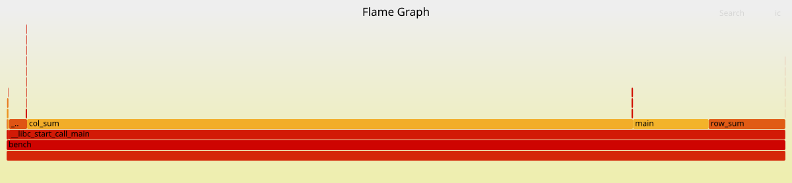

# Profiling Exercise Demo

Runs a simple demo to demonstrate the use of perf to profile C++ code and discover bottlenecks. In this example we iterate through a loop in row-major and column-major order (see below), and see the difference in performance. 


## 1. Compile and Run
```bash
g++ main.cpp -o bench -std=c++20 -O2 -g -fno-omit-frame-pointer
```

Result:
```
row_sum: 10 ms  (result=1.4661e+14)
col_sum: 87 ms  (result=1.40737e+14)
```

## 2. Get stats
```bash
perf stat -e cache-misses,cache-references,cycles,instructions ./bench
```

Result:
```
row_sum: 10 ms  (result=1.4661e+14)
col_sum: 87 ms  (result=1.40737e+14)

 Performance counter stats for './bench':

          17463725      cache-misses:u                   #   33.09% of all cache refs         
          52784090      cache-references:u                                                    
         523084827      cycles:u                                                              
         237156237      instructions:u                   #    0.45  insn per cycle            

       0.132846322 seconds time elapsed

       0.113672000 seconds user
       0.020667000 seconds sys
```

miss rate = (cache-misses / cache-references) * 100 = `33.09%`
instructions per cycle = instructions / cycles = `0.45`

#### Insights: 
row_sum: 10 ms  (result=1.4661e+14)
col_sum: 87 ms  (result=1.40737e+14)
total: 97 ms

We can reason that col_sum takes up ~90% of the runtime. So when we see 33% cache miss that means that's driven primarily by col_sum.

IPC is 045, which means CPU is not being utilized well; there is stalling which is causing it to have less than 1 instruction per cycle. This means that the CPU is waiting for memory to be (memory-bound bottleneck).


#### Running in isolation
##### Row_sum
Commenting out col_sum code, re-compiling and running perf gives:

```
row_sum: 10 ms  (result=1.4661e+14)

 Performance counter stats for './row_sum':

             62169      cache-misses:u                   #    1.16% of all cache refs         
           5357690      cache-references:u                                                    
         116826042      cycles:u                                                              
         153227865      instructions:u                   #    1.31  insn per cycle            

       0.052224278 seconds time elapsed

       0.030368000 seconds user
       0.020245000 seconds sys

```

**Only 1% cache misses, and 1.31 IPC.** 


##### Col_sum
Commenting out row_sum code, re-compiling and running perf gives:

```
col_sum: 88 ms  (result=1.40737e+14)

 Performance counter stats for './col_sum':

          17518734      cache-misses:u                   #   33.91% of all cache refs         
          51659952      cache-references:u                                                    
         472848258      cycles:u                                                              
         170005217      instructions:u                   #    0.36  insn per cycle            

       0.123361221 seconds time elapsed

       0.103809000 seconds user
       0.020761000 seconds sys

```
**33% cache miss, and 0.36 IPC!**

#### Flamegraph
Flamegraph is a tool to visualize stack traces that we can obtain by sampling with perf.

```bash
# install if needed
git clone https://github.com/brendangregg/FlameGraph.git

# record 
perf record -g ./bench  

# generate
perf script | ./FlameGraph/stackcollapse-perf.pl | ./FlameGraph/flamegraph.pl > flame.svg
```


